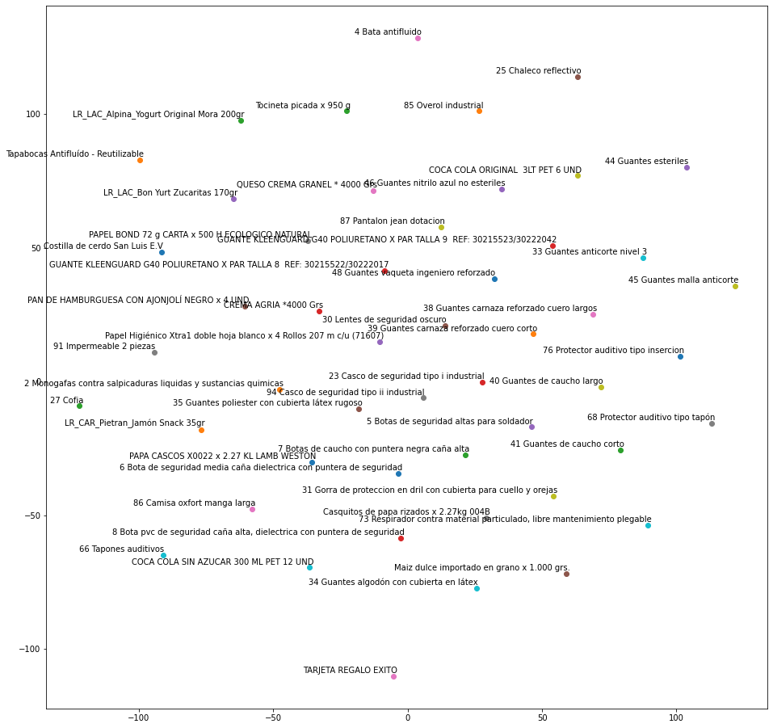
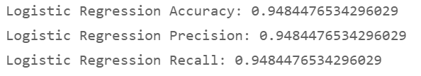
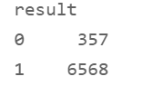
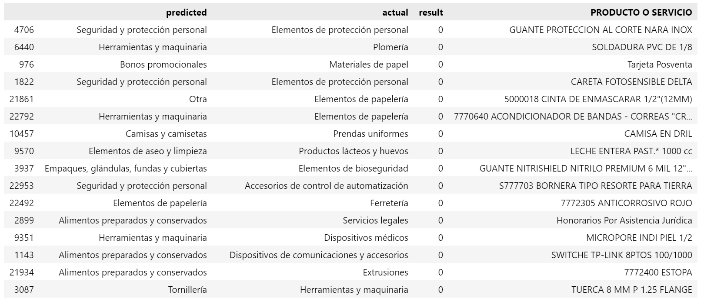

<!-- ABOUT THE PROJECT -->
## About The Project

<!--[![Product Name Screen Shot][product-screenshot]](https://example.com)-->

Con este proyecto nosotros queremos agregar valor agregado que contribuya con el crecimiento de la empresa por medio de las nuevas tecnologias.

### Built With

* [Databricks](https://databricks.com/)
* [spacy](https://spacy.io/usage)
* [t-SNE](https://interactivechaos.com/es/manual/tutorial-de-machine-learning/t-sne)

### TEAM

- Luis Felipe Bedoya Martinez
- Keyssi Margarita Arroyo Mendez
- Yoban Steban Nova Aranda
- Miguel Angel Correa Manrique
- Diego Alejandro Zapata Marin
- Faiber Andres Montes Gomez

### WORFLOW

Dado que en nuestro caso nos enfocaremos en agrupar y sintetizar los requerimientos en las subcategorias recomendadas de acuerdo al historico de las mismas utlizaremos NLP para dicho objetivo, como se envidencia a continuacion estas son las caracteristicas de un Model de procesamiento de lenguaje natural 

### Results

Al correr el model diseñado con la libreria spacy, especializada en NLP pudimos obtener estas metricas del modelo:

Al ver su funcionamiento en un escenario real, tenemos que los 0 son los no predichos correctamente:

y aqui podemos observar algunos de ellos que no se predijeron bien, cabe resaltar que al parecer puede que en la muestre esten mal clasificados por lo que el algoritmo lo aprendio de esta forma, como no podemos concluir en este punto del modelo, como proximo paso se propone indagar dentro de los productos o servicios en que subcateoria estan para asi afianzar nuestro modelo 

