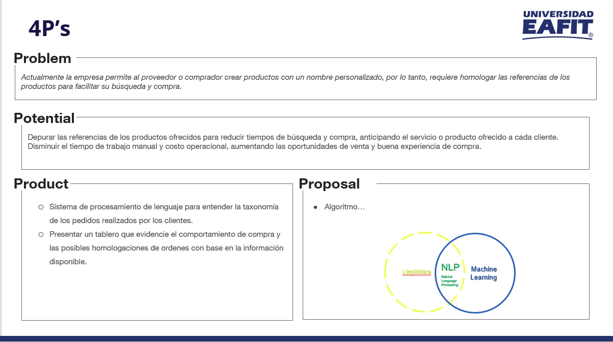

<!-- ABOUT THE PROJECT -->
## About The Project

<!--[![Product Name Screen Shot][product-screenshot]](https://example.com)-->

Con este proyecto nosotros queremos agregar valor agregado que contribuya con el crecimiento de la empresa por medio de las nuevas tecnologias.

### Built With

* [Databricks](https://databricks.com/)

### TEAM

- Luis Felipe Bedoya Martinez
- Keyssi Margarita Arroyo Mendez
- Yoban Steban Nova Aranda
- Miguel Angel Correa Manrique
- Diego Alejandro Zapata Marin
- Faiber Andres Montes Gomez

### WORFLOW

Dado que en nuestro caso nos enfocaremos en agrupar y sintetizar los requerimientos en las subcategorias recomendadas de acuerdo al historico de las mismas utlizaremos NLP para dicho objetivo, como se envidencia a continuacion estas son las caracteristicas de un Model de procesamiento de lenguaje natural 

